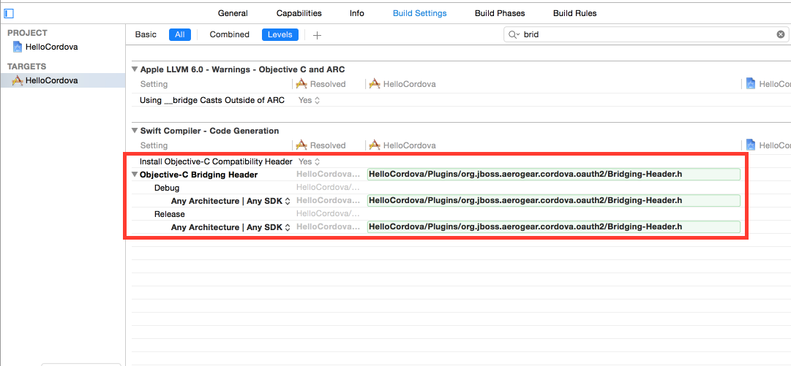
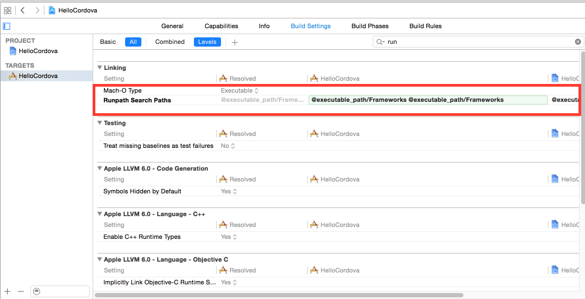

# AeroGear OAuth2 Cordova
The plugin handles OAuth2 *authorization code grant* in a secure manner. The OAuth2 dance uses external browser approach, OAuth2 access and refresh tokens are stored securely encrypted in your native device. 

The plugin wraps the following libs:

* [aerogear-ios-oauth2](https://github.com/aerogear/aerogear-ios-oauth2)
* [aerogear-android-authz](https://github.com/aerogear/aerogear-android-authz)

If you want to see the plugin in action please refer to [aerogear-cordova-cookbook]() Shoot'nShare demo app or/ad just follow the Getting started guide to create your own.

## Getting Started

The Cordova command line tooling is based on node.js so first you’ll need to install node then you can install Cordova by executing:

	$ npm install -g cordova

To deploy on iOS you need to install the ios-deploy package as well

	$ npm install -g ios-deploy

### Create the App

Create a new app by executing:

	$ cordova create <project-name> [app-id] [app-name]

### Add platform(s)

Specify a set of target platforms by executing:

	$ cordova platform add <platform>

The available platform values are ios and android.

### Install the plugin

Install the aerogear-oauth2-plugin plugin by executing:

	$ cordova plugin add https://github.com/edewit/aerogear-oauth2-plugin.git

### Sample example

In `wwww/js/index.js` file, to start the OAuth2 dance as soon as `onDeviceReady` event is fired, add the foloowing snippet:

```javascript
  onDeviceReady: function () {
    app.receivedEvent('deviceready');
    oauth2.add({
      base: "https://accounts.google.com",
      authzEndpoint: "o/oauth2/auth",
      redirectURL: "io.cordova.hellocordova:/oauth2callback",
      accessTokenEndpoint: "o/oauth2/token",
      clientId: "517285908032-nnkcrot1727fmd738pug6clbqlgosffs.apps.googleusercontent.com",
      refreshTokenEndpoint: "o/oauth2/token",
      revokeTokenEndpoint: "rest/revoke",
      scopes: 'openid, email',
      accountId: 'google'
    });

    oauth2.requestAccess()
      .then(function (result) {
        console.log(result);
      }, function (error) {
        alert(error);
      });
  },
```

### Workaround for iOS

Our iOS version is using a Swift library. Cordova is not yet fully supporting Swift, when running cordova plugin add command, you will get an usefull information telling you to open xcode and do the followinf 3 tweaks:

1. change `deployment target` to 7.0 or above


2. add `[Project Name]/Plugins/org.jboss.aerogear.cordova.oauth2/Bridging-Header.h` to Objective-c Bridging Header    under the Swift Compiler - Code Generation options


3. set LD_RUNPATH_SEARCH_PATHS to "$(inherited) @executable_path/Frameworks"


## Todo

This is a very early version:
- remove Swift hack on xcodeproject
- have a GoogleConfig, KeycloakConfig available in JavaScript
- handle oauth2 token in http headers
- expose refreshToken, revokeToken
- android version
